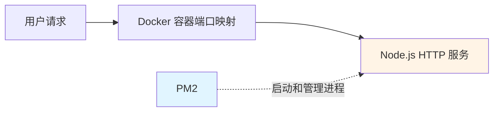
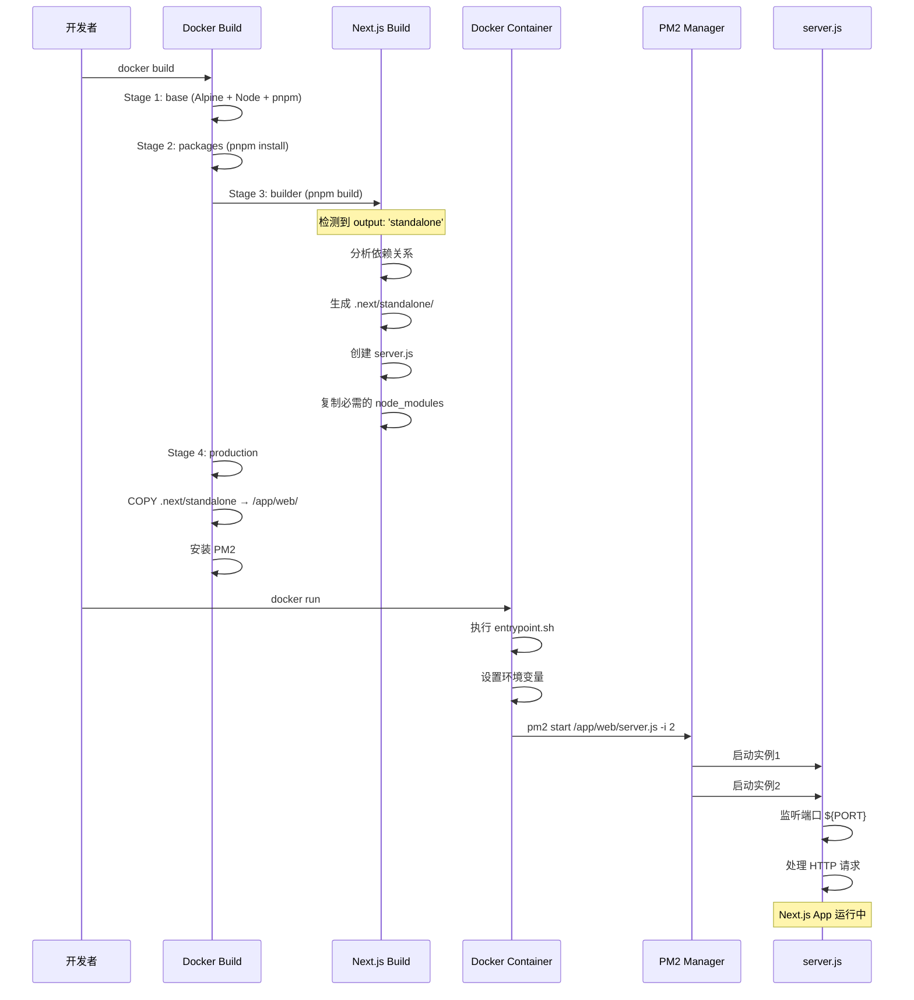
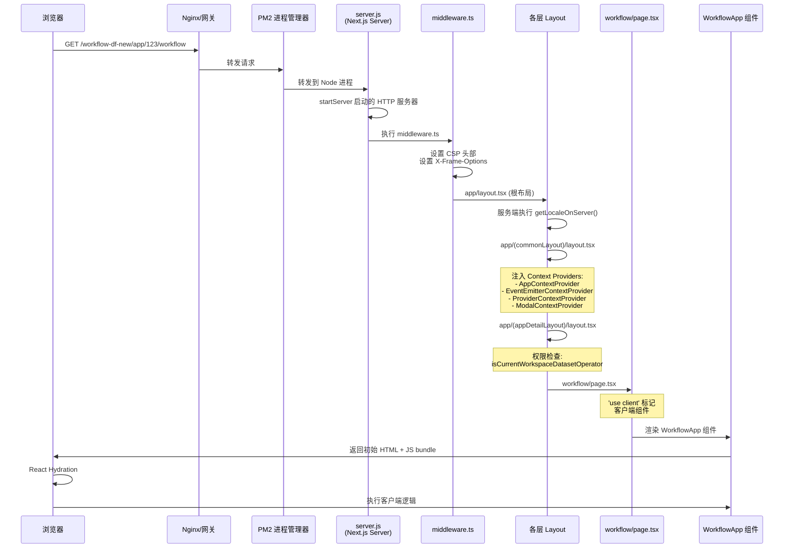

# Dify 工作流解析

## 1. 前言（why，what）

什么是工作流？什么是 AI 工作流？什么是 Dify，解决什么问题？

- 工作流定义：将工作流程分解为 **可执行的结构化步骤**， 每个步骤都是对业务规则的抽象、概括描述。
- 工作流目标：利用计算机在多个操作步骤间按某种预定规则 **自动传递信息**、文档或者任务，实现某个业务目标。
- AI 工作流：Agentic Workflow 是将 Agent 能力（推理规划 Planning、工具调用 Function Calling、反思总结 Reflection）融合入传统工作流的智能工作流。
  - 对比传统工作流：引入 Agent 的自我分析、决策、学习能力，打破了其确定性，增强其灵活性、适应性，以便处理更复杂任务（会议总结、智能客服等）。
  - 对比 AI Agent：引入工作流的编排能力，减少 AI Agent 的不确定性，扩展 AI Agent 的能力边界（A2A 编排等）。

**Dify** 只是搭建 AI 工作流的平台之一，它在这些基础理念上通过自己的产品定义让用户搭建 AI 工作流，解决企业问题。

参考：

- [一文看懂：AI 圈刷屏的 Agentic Workflows 到底是个啥？](https://developer.volcengine.com/articles/7517866342792314943#heading23)
- [Dify 产品手册](https://docs.dify.ai/zh/use-dify/getting-started/introduction)

## 2. 源码解读（how）

在进入枯燥的源代码解读前，首先看下 Dify Workflow 前端原作者对外的分享:

- 视频：[超越界面：前端工程师如何塑造 AI 原生应用的未来 - 吴天炜](https://fedev.cn/video/play/701606bc91638d618ac990493a4972c8)
- PDF：[超越界面：前端工程师如何塑造 AI 原生应用的未来](https://github.com/fequancom/FEDAY/blob/main/2025/feday2025-%E8%B6%85%E8%B6%8A%E7%95%8C%E9%9D%A2%EF%BC%9A%E5%89%8D%E7%AB%AF%E5%B7%A5%E7%A8%8B%E5%B8%88%E5%A6%82%E4%BD%95%E5%A1%91%E9%80%A0%20AI%20%E5%8E%9F%E7%94%9F%E5%BA%94%E7%94%A8%E7%9A%84%E6%9C%AA%E6%9D%A5.pdf)

下图是作者对 Dify Workflow 前端的总结：

<div align="center">  </div>

### 前端架构

为了循序渐进解读 Dify 工作流的前端逻辑，笔者按个人理解将业务代码分为以下 6 层：

<div align="center">  </div>

- 路由层：解释用户请求如何获取入口文件，并在浏览器渲染出整个 workflow 页面；
- 绘制层：解释如何实现 workflow 的 Canvas 层，允许用户拖拽编排 workflow 并同步至后端；
- 执行层：解释用户在界面点击运行 workflow 后，前端做了哪些工作展示其运行流程；
- 变量系统：解释 workflow 如何在节点间进行信息传递；
- 状态管理：解释 workflow 前端整个 stores 的管理逻辑；
- 应用层：解释 workflow 如何实现基础能力（编排、运行）之外的补充能力（调试、版本控制等）

### 2.1 路由层
路由层主要解释一个问题：用户浏览器请求 `https://origin.com/app/{appId}/workflow?paramA=xxx&paramB=yyy`如何从容器中获取静态资源并将首页渲染？我们将此问题拆分成两个以下两个问题：

**1. 用户请求从浏览器到服务端的请求链路是什么？** <br/>
**2. 用户请求到达服务端后，返回的页面资源是什么？**

首先解释一下整个请求链路：


> **说明**: PM2 只负责启动和管理 Node.js HTTP 服务进程，流量通过 Docker 容器端口映射直接打到 HTTP 服务

::: tip
**1.为什么整个请求打到的是 docker 镜像内启动的一个 HTTP 服务器上，而不是像传统 Nginx 一样返回整个项目静态资源的入口 index.html 文件呢？**


首先 Dify 是基于 Next.js 的 SSR 项目，与传统的 SPA 项目不同。传统的 SPA 项目通过构建工具（ Webpack、Vite 等）将所有资源打包成静态文件，部署到 Nginx 上，由 Nginx 直接返回 index.html 文件给浏览器渲染（CSR）。而 SSR 项目是服务端动态渲染的，需要通过在 docker 镜像上跑内置 HTTP 服务动态生成页面资源给浏览器。下面是两种部署方案的对比：

**静态网站（Nginx）**
```bash
用户访问: https://example.com/about.html

Nginx:
1. 在磁盘上查找 /var/www/html/about.html
2. 读取文件内容
3. 返回 200 OK + 文件内容

耗时: ~1ms（仅文件 I/O）
```
**Next.js SSR（Node.js Server）**
```bash
用户访问: https://example.com/app/123/workflow

Next.js Server:
1. 解析 URL → 匹配路由 [appId]
2. 提取参数 appId=123
3. 执行 Layout 组件（async）
4. 可能调用 API 获取数据
5. 渲染 React 组件树到 HTML
6. 注入数据和状态
7. 生成完整的 HTML 文档
8. 返回 200 OK + 动态生成的 HTML

耗时: ~50-200ms（包含数据获取和渲染）
```
:::

接着我们通过剖析生成 docker 镜像的配置文件，理解为何项目最终的部署形态为何是一个 HTTP 服务：

```dockerfile
# base image 1. 配置镜像基础环境：node版本、npm镜像源、pnpm包管理器
FROM node:24-alpine AS base
LABEL maintainer="takatost@gmail.com"

# if you located in China, you can use aliyun mirror to speed up
# RUN sed -i 's/dl-cdn.alpinelinux.org/mirrors.aliyun.com/g' /etc/apk/repositories

# if you located in China, you can use taobao registry to speed up
# RUN npm config set registry https://registry.npmmirror.com

RUN apk add --no-cache tzdata
RUN corepack enable
ENV PNPM_HOME="/pnpm"
ENV PATH="$PNPM_HOME:$PATH"

# install packages 2. 下载依赖包资源
FROM base AS packages

WORKDIR /app/web
COPY package.json pnpm-lock.yaml /app/web/

RUN corepack install
RUN pnpm install --frozen-lockfile

# build resources 3. 构建包资源，注意这里触发 Next.js 构建流程，详情转见 next.config.js 文件
FROM base AS builder
WORKDIR /app/web
COPY --from=packages /app/web/ .
COPY . .

ENV NODE_OPTIONS="--max-old-space-size=4096"
RUN pnpm build:docker 

# production 4. 生产镜像
FROM base AS production

# 4.1 复制关键产物进 standalone 文件夹中
COPY --from=builder --chown=dify:dify /app/web/public ./public
COPY --from=builder --chown=dify:dify /app/web/.next/standalone ./
COPY --from=builder --chown=dify:dify /app/web/.next/static ./.next/static

# 4.2 配置一堆环境变量...

# 4.3 安装pm2进行node进程管理
RUN pnpm add -g pm2

# 5.执行容器启动脚本
ENTRYPOINT ["/bin/sh", "./entrypoint.sh"]
```

``` shell
# entrypoint.sh
# 1.设置环境变量（在容器运行时动态设置）
export NEXT_PUBLIC_DEPLOY_ENV=${DEPLOY_ENV}
export NEXT_PUBLIC_EDITION=${EDITION}
export NEXT_PUBLIC_BASE_PATH=${NEXT_PUBLIC_BASE_PATH}
...

# 2. 使用 PM2 启动并管理 next.js 在 standalone 模式下生成的 HTTP 服务器
pm2 start /app/web/server.js \ 进程脚本入口
    --name dify-web \ 进程名称
    --cwd /app/web \ 进程工作目录
    -i ${PM2_INSTANCES} \ 启用实例数
    --no-daemon
```

``` javascript
const nextConfig = {
   ...
   output: 'standalone', // standalone 关键配置
}
```

::: tip
**1. next.config.js 配置中 output: 'standalone' 有什么作用？**

 查阅 [官方文档](https://nextjs.org/docs/app/api-reference/config/next-config-js/output#automatically-copying-traced-files) 可知有如下作用：

 - （1）生成一个 HTTP 独立服务器项目文件，文件目录如下所示：
``` txt
.next/standalone/
├── server.js              # 🎯 Node.js 服务器入口！
├── package.json           # 最小化依赖
├── node_modules/          # 仅包含运行时必需的依赖
├── app/                   # 应用代码
├── public/                # 静态资源
└── .next/                 # Next.js 运行时
    └── server/            # 服务端代码
        └── app/           # 编译后的页面
```

- (2) 自动追踪依赖。Next.js 分析代码，只打包运行时需要的 node_modules，显著减小镜像体积。

**2. 总结 docker 镜像的生成流程及最终形态？**

:::

下面我们探讨第二个问题，请求打到 HTTP 服务器后返回的静态资源是什么，以及页面是如何解析渲染的？





### 2.2 绘制层

### 2.3 执行层

### 2.4 变量系统

### 2.5 状态管理

### 2.6 应用层
