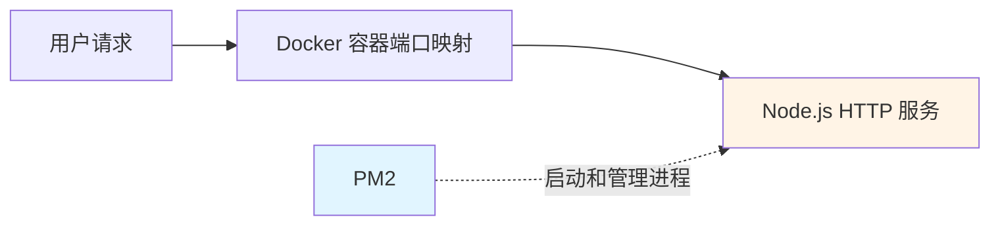
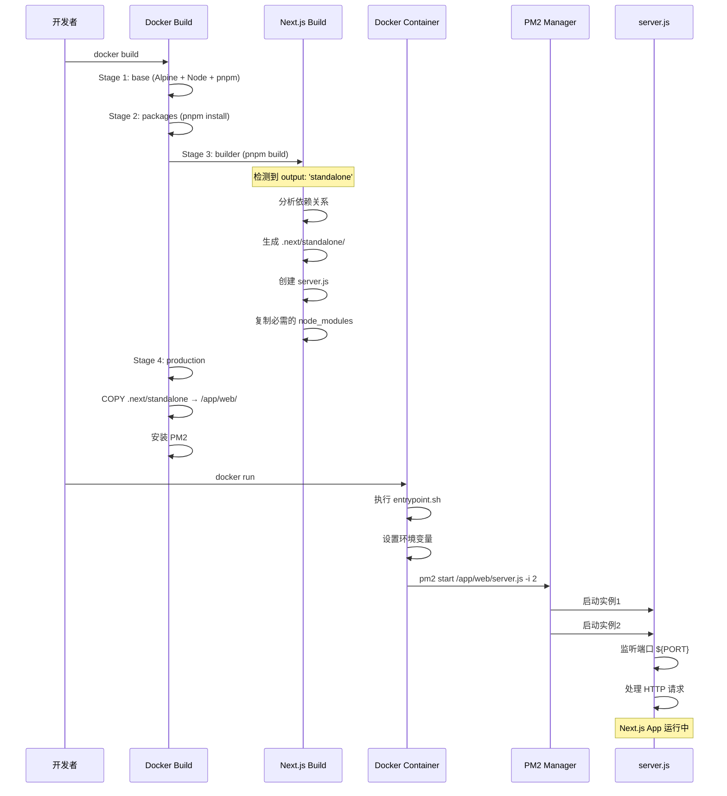
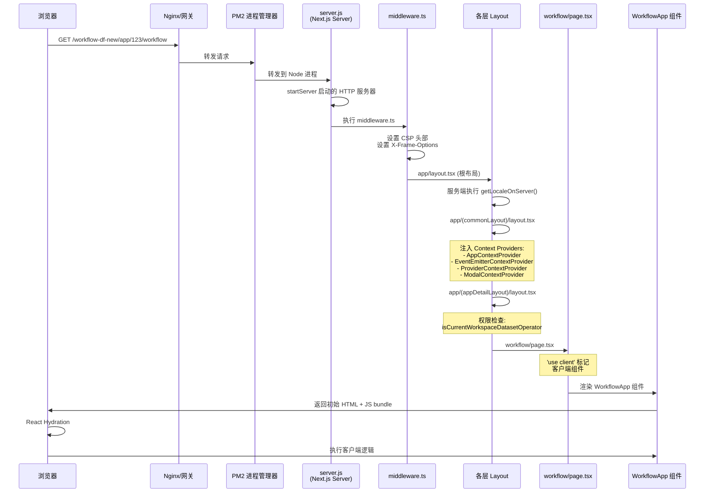
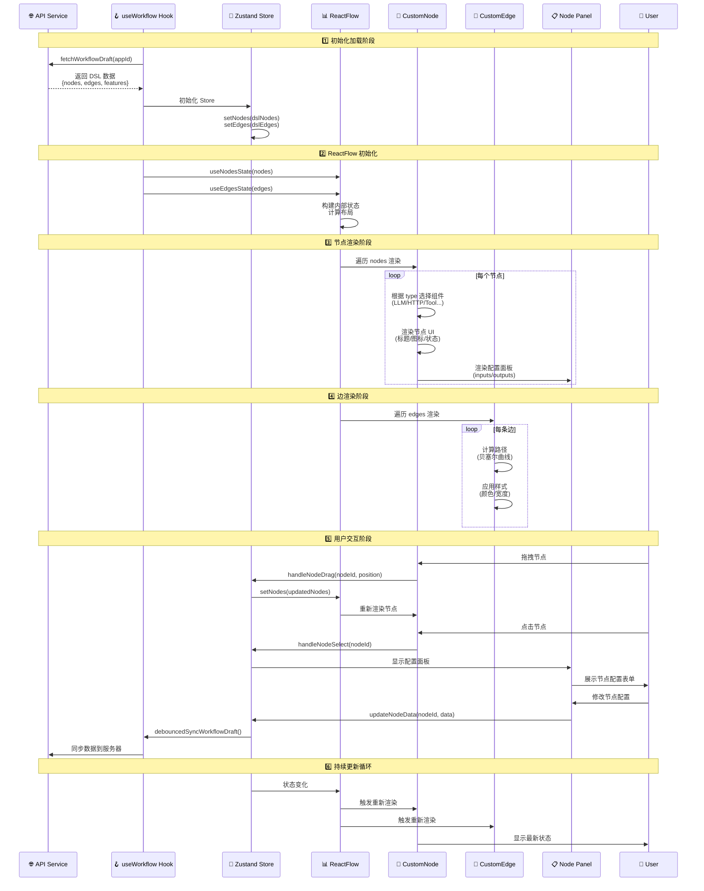

# Dify 工作流解析

## 1. 前言（why，what）

什么是工作流？什么是 AI 工作流？什么是 Dify，解决什么问题？

- 工作流定义：将工作流程分解为 **可执行的结构化步骤**， 每个步骤都是对业务规则的抽象、概括描述。
- 工作流目标：利用计算机在多个操作步骤间按某种预定规则 **自动传递信息**、文档或者任务，实现某个业务目标。
- AI 工作流：Agentic Workflow 是将 Agent 能力（推理规划 Planning、工具调用 Function Calling、反思总结 Reflection）融合入传统工作流的智能工作流。
  - 对比传统工作流：引入 Agent 的自我分析、决策、学习能力，打破了其确定性，增强其灵活性、适应性，以便处理更复杂任务（会议总结、智能客服等）。
  - 对比 AI Agent：引入工作流的编排能力，减少 AI Agent 的不确定性，扩展 AI Agent 的能力边界（A2A 编排等）。

**Dify** 只是搭建 AI 工作流的平台之一，它在这些基础理念上通过自己的产品定义让用户搭建 AI 工作流，解决企业问题。

参考：

- [一文看懂：AI 圈刷屏的 Agentic Workflows 到底是个啥？](https://developer.volcengine.com/articles/7517866342792314943#heading23)
- [Dify 产品手册](https://docs.dify.ai/zh/use-dify/getting-started/introduction)

## 2. 源码解读（how）

在进入枯燥的源代码解读前，首先看下 Dify Workflow 前端原作者对外的分享:

- 视频：[超越界面：前端工程师如何塑造 AI 原生应用的未来 - 吴天炜](https://fedev.cn/video/play/701606bc91638d618ac990493a4972c8)
- PDF：[超越界面：前端工程师如何塑造 AI 原生应用的未来](https://github.com/fequancom/FEDAY/blob/main/2025/feday2025-%E8%B6%85%E8%B6%8A%E7%95%8C%E9%9D%A2%EF%BC%9A%E5%89%8D%E7%AB%AF%E5%B7%A5%E7%A8%8B%E5%B8%88%E5%A6%82%E4%BD%95%E5%A1%91%E9%80%A0%20AI%20%E5%8E%9F%E7%94%9F%E5%BA%94%E7%94%A8%E7%9A%84%E6%9C%AA%E6%9D%A5.pdf)

下图是作者对 Dify Workflow 前端的总结：

<div align="center">  </div>

### 前端架构

为了循序渐进解读 Dify 工作流的前端逻辑，笔者按个人理解将业务代码分为以下 6 层：

<div align="center">  </div>

- 路由层：解释用户请求如何获取入口文件，并在浏览器渲染出整个 workflow 页面；
- 绘制层：解释如何实现 workflow 的 Canvas 层，允许用户拖拽编排 workflow 并同步至后端；
- 执行层：解释用户在界面点击运行 workflow 后，前端做了哪些工作展示其运行流程；
- 变量系统：解释 workflow 如何在节点间进行信息传递；
- 状态管理：解释 workflow 前端整个 stores 的管理逻辑；
- 应用层：解释 workflow 如何实现基础能力（编排、运行）之外的补充能力（调试、版本控制等）

### 2.1 路由层
路由层主要解释一个问题：用户浏览器请求 `https://origin.com/app/{appId}/workflow?paramA=xxx&paramB=yyy`如何从容器中获取静态资源并将首页渲染？我们将此问题拆分成两个以下两个问题：

**1. 用户请求从浏览器到服务端的请求链路是什么？** <br/>
**2. 用户请求到达服务端后，返回的页面资源是什么？**

首先解释一下整个请求链路：


> **说明**: PM2 只负责启动和管理 Node.js HTTP 服务进程，流量通过 Docker 容器端口映射直接打到 HTTP 服务

::: tip
**1.为什么整个请求打到的是 docker 镜像内启动的一个 HTTP 服务器上，而不是像传统 Nginx 一样返回整个项目静态资源的入口 index.html 文件呢？**


首先 Dify 是基于 Next.js 的 SSR 项目，与传统的 SPA 项目不同。传统的 SPA 项目通过构建工具（ Webpack、Vite 等）将所有资源打包成静态文件，部署到 Nginx 上，由 Nginx 直接返回 index.html 文件给浏览器渲染（CSR）。而 SSR 项目是服务端动态渲染的，需要通过在 docker 镜像上跑内置 HTTP 服务动态生成页面资源给浏览器。下面是两种部署方案的对比：

**静态网站（Nginx）**
```bash
用户访问: https://example.com/about.html

Nginx:
1. 在磁盘上查找 /var/www/html/about.html
2. 读取文件内容
3. 返回 200 OK + 文件内容

耗时: ~1ms（仅文件 I/O）
```
**Next.js SSR（Node.js Server）**
```bash
用户访问: https://example.com/app/123/workflow

Next.js Server:
1. 解析 URL → 匹配路由 [appId]
2. 提取参数 appId=123
3. 执行 Layout 组件（async）
4. 可能调用 API 获取数据
5. 渲染 React 组件树到 HTML
6. 注入数据和状态
7. 生成完整的 HTML 文档
8. 返回 200 OK + 动态生成的 HTML

耗时: ~50-200ms（包含数据获取和渲染）
```
:::

接着我们通过剖析生成 docker 镜像的配置文件，理解为何项目最终的部署形态为何是一个 HTTP 服务：

```dockerfile
# base image 1. 配置镜像基础环境：node版本、npm镜像源、pnpm包管理器
FROM node:24-alpine AS base
LABEL maintainer="takatost@gmail.com"

# if you located in China, you can use aliyun mirror to speed up
# RUN sed -i 's/dl-cdn.alpinelinux.org/mirrors.aliyun.com/g' /etc/apk/repositories

# if you located in China, you can use taobao registry to speed up
# RUN npm config set registry https://registry.npmmirror.com

RUN apk add --no-cache tzdata
RUN corepack enable
ENV PNPM_HOME="/pnpm"
ENV PATH="$PNPM_HOME:$PATH"

# install packages 2. 下载依赖包资源
FROM base AS packages

WORKDIR /app/web
COPY package.json pnpm-lock.yaml /app/web/

RUN corepack install
RUN pnpm install --frozen-lockfile

# build resources 3. 构建包资源，注意这里触发 Next.js 构建流程，详情转见 next.config.js 文件
FROM base AS builder
WORKDIR /app/web
COPY --from=packages /app/web/ .
COPY . .

ENV NODE_OPTIONS="--max-old-space-size=4096"
RUN pnpm build:docker 

# production 4. 生产镜像
FROM base AS production

# 4.1 复制关键产物进 standalone 文件夹中
COPY --from=builder --chown=dify:dify /app/web/public ./public
COPY --from=builder --chown=dify:dify /app/web/.next/standalone ./
COPY --from=builder --chown=dify:dify /app/web/.next/static ./.next/static

# 4.2 配置一堆环境变量...

# 4.3 安装pm2进行node进程管理
RUN pnpm add -g pm2

# 5.执行容器启动脚本
ENTRYPOINT ["/bin/sh", "./entrypoint.sh"]
```

``` shell
# entrypoint.sh
# 1.设置环境变量（在容器运行时动态设置）
export NEXT_PUBLIC_DEPLOY_ENV=${DEPLOY_ENV}
export NEXT_PUBLIC_EDITION=${EDITION}
export NEXT_PUBLIC_BASE_PATH=${NEXT_PUBLIC_BASE_PATH}
...

# 2. 使用 PM2 启动并管理 next.js 在 standalone 模式下生成的 HTTP 服务器
pm2 start /app/web/server.js \ 进程脚本入口
    --name dify-web \ 进程名称
    --cwd /app/web \ 进程工作目录
    -i ${PM2_INSTANCES} \ 启用实例数
    --no-daemon
```

``` javascript
const nextConfig = {
   ...
   output: 'standalone', // standalone 关键配置
}
```

::: tip
**1. next.config.js 配置中 output: 'standalone' 有什么作用？**

 查阅 [官方文档](https://nextjs.org/docs/app/api-reference/config/next-config-js/output#automatically-copying-traced-files) 可知有如下作用：

 - （1）生成一个 HTTP 独立服务器项目文件，文件目录如下所示：
``` txt
.next/standalone/
├── server.js              # 🎯 Node.js 服务器入口！
├── package.json           # 最小化依赖
├── node_modules/          # 仅包含运行时必需的依赖
├── app/                   # 应用代码
├── public/                # 静态资源
└── .next/                 # Next.js 运行时
    └── server/            # 服务端代码
        └── app/           # 编译后的页面
```

- (2) 自动追踪依赖。Next.js 分析代码，只打包运行时需要的 node_modules，显著减小镜像体积。

**2. 总结 docker 镜像的生成流程及最终形态？**

:::

下面我们探讨第二个问题，请求打到 HTTP 服务器后返回的静态资源是什么，以及页面是如何解析渲染的？



上图是入口文件 index.html 请求到返回的整个流程图，最终页面渲染的是工作流 WorkflowApp 组件，即工作流整张画布视图。观察用户请求 url `https://origin.com/app/{appId}/workflow?paramA=xxx&paramB=yyy` 和流程图会发现文件是按照 url 的 path 逐步加载的，所以其 index.html 文件内容也是按照 path 逐步加载。

::: tip
**1. 为什么文件会按照 url 的 path 逐步解析加载？**
 
  查阅 [官方文档](https://nextjscn.org/docs/app/getting-started/layouts-and-pages) ，next.js 使用的 是基于文件的路由模式，包含 pages-router 和 app-router 两种方式，后者逐渐将前者替换，项目中使用 app-router 模式。app-router 模式有以下特点：
  
  - **`app` 为根路径**：项目中必须包含 /app 文件夹，其定义了项目的入口文件 layout.tsx 和 page.tsx：
    - `layout.tsx`: 通常包含页面的布局，状态管理，其内容具备持久化的特性，在页面切换路由时 layout 不会重新渲染。默认会把同目录下的 page.tsx 文件作为 children 载入。
    - `page.tsx`: 页面实际渲染的内容。

  - **path 和 文件夹名称应该一一对应，文件夹下只有 page.tsx 内容会被返回给客户端。** 例如 url 中 /app/blog 路径 对应的是 /app 和 /app/blog 文件夹下的 page.tsx文件。

:::

观察浏览器拿到的入口文件 html 内容：
``` html
<html lang="zh-Hans" class="h-full">
    <head>
        <meta charSet="utf-8"/>
        <meta name="viewport" content="width=device-width, initial-scale=1, maximum-scale=1, viewport-fit=cover, user-scalable=no"/>
        <link rel="stylesheet" href="/workflow-df-new/_next/static/css/0b6c82cd8266984c.css" data-precedence="next"/>
        <!-- 剩余 css chunk 导入... -->
        <script src="/workflow-df-new/_next/static/chunks/7aab8a33-9db54bd204dcd9b2.js" async=""></script>
        <!-- 剩余 js chunk 导入... -->
        <link rel="preload" href="/workflow-df-new/_next/static/css/25747ad1f8ee13b4.css" as="style"/>
        <!-- 剩余 preload css chunk 导入... -->
        <meta name="theme-color" content="#FFFFFF"/>
        <meta name="mobile-web-app-capable" content="yes"/>
        <meta name="apple-mobile-web-app-capable" content="yes"/>
        <meta name="apple-mobile-web-app-status-bar-style" content="default"/>
        <title>万擎</title>
        <script src="/workflow-df-new/_next/static/chunks/polyfills-42372ed130431b0a.js" noModule=""></script>
    </head>
    <body class="color-scheme h-full select-auto" data-api-prefix="https://wanqing.corp.kuaishou.com/api/workflow/console/api" data-web-prefix="https://wanqing.corp.kuaishou.com/workflow-df-new" data-pubic-api-prefix="https://wanqing.corp.kuaishou.com/api/workflow/api" data-marketplace-api-prefix="https://wanqing.corp.kuaishou.com/mcp/list/api/v1" data-marketplace-url-prefix="https://wanqing.corp.kuaishou.com/mcp/list" data-public-edition="SELF_HOSTED" data-public-sentry-dsn="" data-public-site-about="" data-public-text-generation-timeout-ms="" data-public-max-tools-num="" data-public-max-parallel-limit="20" data-public-top-k-max-value="" data-public-indexing-max-segmentation-tokens-length="" data-public-loop-node-max-count="" data-public-max-iterations-num="" data-public-enable-website-jinareader="true" data-public-enable-website-firecrawl="true" data-public-enable-website-watercrawl="true">
        <div hidden="">
        <!--$-->
        <!--/$-->
        </div>
        <script>
            ( (a, b, c, d, e, f, g, h) => {
                let i = document.documentElement
                  , j = ["light", "dark"];
                function k(b) {
                    var c;
                    (Array.isArray(a) ? a : [a]).forEach(a => {
                        let c = "class" === a
                          , d = c && f ? e.map(a => f[a] || a) : e;
                        c ? (i.classList.remove(...d),
                        i.classList.add(f && f[b] ? f[b] : b)) : i.setAttribute(a, b)
                    }
                    ),
                    c = b,
                    h && j.includes(c) && (i.style.colorScheme = c)
                }
                if (d)
                    k(d);
                else
                    try {
                        let a = localStorage.getItem(b) || c
                          , d = g && "system" === a ? window.matchMedia("(prefers-color-scheme: dark)").matches ? "dark" : "light" : a;
                        k(d)
                    } catch (a) {}
            }
            )("data-theme", "theme", "light", "light", ["light", "dark"], null, true, true)
        </script>
        <div class="flex w-full items-center justify-center h-full ">
            <div class="ant-spin ant-spin-spinning css-tchc97 css-var-_R_9db_" aria-live="polite" aria-busy="true">
                <span class="ant-spin-dot-holder">
                    <span class="ant-spin-dot ant-spin-dot-spin">
                        <i class="ant-spin-dot-item"></i>
                        <i class="ant-spin-dot-item"></i>
                        <i class="ant-spin-dot-item"></i>
                        <i class="ant-spin-dot-item"></i>
                    </span>
                </span>
            </div>
        </div>
        <script src="/workflow-df-new/_next/static/chunks/webpack-59ae8763659d8ae2.js" id="_R_" async=""></script>
        <script>
            (self.__next_f = self.__next_f || []).push([0])
        </script>
        <script>
            self.__next_f.push([1, "1:\"$Sreact.fragment\"\n"])
        </script>
        <script>
            self.__next_f.push([1, "3:I[21947,[\"3977\",\"static/chunks/392e555d-3b4326cb9fab1284.js\",\"1704\",\"static/chunks/39231027-ea43f00c801eb2a8.js\",\"8226\",\"static/chunks/8c5afdf4-4c810da4eec2bcee.js\",\"8733\",\"static/chunks/bda40ab4-0d9c60127404663f.js\",\"7326\",\"static/chunks/fc43f782-ceebcfac1567e8cc.js\",\"6640\",\"static/chunks/1471f7b3-fbc0c70f3343877a.js\",\"6518\",\"static/chunks/9c9bef96-98ae838928f2d690.js\",\"86\",\"static/chunks/d3d642e5-f7a4a4857812044b.js\",\"4260\",\"static/chunks/4f2365cb-e4a2ad1f2c319bec.js\",\"4277\",\"static/chunks/72a272a0-7fb8920f52d3a144.js\",\"9423\",\"static/chunks/a010a182-e1f2d91eecc27c2f.js\",\"1562\",\"static/chunks/1562-b1faeca6d0858fe1.js\",\"7318\",\"static/chunks/7318-761be5e277b14d2b.js\",\"6536\",\"static/chunks/6536-39734acef4b6e53c.js\",\"3771\",\"static/chunks/3771-28a09f3256a156a5.js\",\"6841\",\"static/chunks/6841-5cb9c00d8f656c63.js\",\"1162\",\"static/chunks/1162-ebdc371e325b956f.js\",\"6553\",\"static/chunks/6553-702945124b8c4e39.js\",\"3651\",\"static/chunks/3651-a0d2562a98a488ba.js\",\"1730\",\"static/chunks/1730-349f251213689e9a.js\",\"5290\",\"static/chunks/5290-12863c4bce6a28ee.js\",\"427\",\"static/chunks/427-10341fb48467793e.js\",\"2923\",\"static/chunks/2923-d446f9302091bb3d.js\",\"6252\",\"static/chunks/6252-f359ac2f4182cf6e.js\",\"2641\",\"static/chunks/2641-4c0fb313afc938fa.js\",\"8652\",\"static/chunks/8652-39504771ef364941.js\",\"2479\",\"static/chunks/2479-ba8ab4b8e3092aea.js\",\"4724\",\"static/chunks/4724-f3953a02c2481dce.js\",\"1528\",\"static/chunks/1528-8029d33163541a54.js\",\"5495\",\"static/chunks/5495-54fbacc38cce9082.js\",\"3192\",\"static/chunks/3192-d109d558367d8dc3.js\",\"156\",\"static/chunks/156-e7feeedab40f0743.js\",\"245\",\"static/chunks/245-6589b35fd319f60f.js\",\"3267\",\"static/chunks/3267-5720985e8a6b90f3.js\",\"1947\",\"static/chunks/1947-26b8bd2bc6ca35f4.js\",\"3284\",\"static/chunks/3284-42c9375899481ea8.js\",\"2706\",\"static/chunks/2706-36182763cd5e9dd0.js\",\"3949\",\"static/chunks/3949-4456cd9c98425241.js\",\"8018\",\"static/chunks/app/(commonLayout)/layout-eb0d13a098fd97fe.js\"],\"AppContextProvider\"]\n"])
        </script>
        <!-- 剩余 Streaming SSR（流式服务渲染）chunk 导入... -->
        <script>
            self.__next_f.push([1, "18:[[\"$\",\"meta\",\"0\",{\"charSet\":\"utf-8\"}],[\"$\",\"meta\",\"1\",{\"name\":\"viewport\",\"content\":\"width=device-width, initial-scale=1, maximum-scale=1, viewport-fit=cover, user-scalable=no\"}]]\n14:null\n16:{\"metadata\":[[\"$\",\"title\",\"0\",{\"children\":\"万擎\"}]],\"error\":null,\"digest\":\"$undefined\"}\n1b:\"$16:metadata\"\n"])
        </script>
        <script type="text/javascript" src="/accessproxy_statics/h5_fp.js" defer></script>
        <script type="text/javascript" src="/accessproxy_statics/wm.js" defer></script>
        <script type="text/javascript" src="/accessproxy_statics/chrome_banner.js" defer></script>
    </body>
</html>
```

观察 index.html 文件可以发现，虽然入口文件是 HTTP 服务器通过脚本动态生成的（SSR），但其引用的静态资源 chunk 是 docker 容器 build 阶段通过前端打包工具（如 webpack）打包生成，被所有 SSR 请求重复使用。

::: tip
**1. SSR 的多实例部署问题如何解决？**

**问题背景：** 前端上线往往会采用分级发布方式，假设前端容器有 instance1，instance2 两个实例，instance1 上部署最新版本 version2 时，instance2 上仍运行着旧版本 version1。此时如果用户请求打入 instance1 通过 version2 SSR 返回的 index.html 中内联了 chunk 文件（如 main.abc123.js），而该 chunk 文件的 fetch 请求打入了 instance2 ( chunk 文件在 version2 中发生了变更，则可能导致 instance1 和 instance2 同时存在不同版本的 chunk 文件)，从而引发兼容性问题，导致页面白屏。

**解决方案：** 版本化静态资源路径 + 静态资源上传至 cdn。核心要点：
1. 静态资源走 CDN，版本化路径；
2. SSR 时根据当前版本输出对应 CDN URL；
3. 老版本资源保留一段时间（缓存过期）。

**2. 什么是 前端水合（Hydration）？**

 水合是前端 SSR 渲染特有的机制，服务端生成静态 html 返回给浏览器渲染后，浏览器 fetch JS Chunk 对页面 DOM 挂载交互事件的过程被称为 “水合”。参考 [什么是前端水合？](https://juejin.cn/post/7609743163905900563)

```bash
┌─────────────────────────────────────────────────────────────┐
│                   完整渲染流程                                │
└─────────────────────────────────────────────────────────────┘

1️⃣ 服务器渲染阶段
┌──────────────┐
│  React 组件   │
│  function()  │
└──────┬───────┘
       │
       ▼
  renderToString()
       │
       ▼
┌──────────────┐     ┌──────────────┐
│  HTML 字符串  │ →   │  发送给浏览器  │
└──────────────┘     └──────────────┘

2️⃣ 浏览器接收阶段
┌──────────────┐
│  接收 HTML    │ ← 用户能看到页面（但不能交互）
└──────┬───────┘
       │
       ▼
┌──────────────┐
│  解析并渲染    │
│  构建 DOM 树  │
└──────┬───────┘
       │
       ▼
┌──────────────┐
│ 下载 JS 文件  │
└──────┬───────┘

3️⃣ 水合阶段
       │
       ▼
┌──────────────┐
│ 执行 JS 代码  │
│ React 初始化  │
└──────┬───────┘
       │
       ▼
  hydrateRoot()
       │
       ├─→ 重新执行组件函数
       │   生成虚拟 DOM
       │
       ├─→ 对比服务器 HTML
       │   和虚拟 DOM
       │
       │   ✅ 匹配？
       │   ├─ Yes → 复用 DOM + 绑定事件
       │   └─ No  → ⚠️ 报错 + 强制重新渲染
       │
       └─→ 绑定事件监听器
           初始化状态管理

4️⃣ 可交互阶段
┌──────────────┐
│  页面完全激活  │ ← 用户可以点击、输入
└──────────────┘
       │
       ▼
  后续正常的 React 更新流程
```
**水合问题：** 通常指的是客户端执行 JS 生成的虚拟 DOM 和 服务端渲染的 html DOM 结构不一致。导致水合问题的根因有很多，例如：1. DOM 中包含生成时间戳代码 2. DOM中包含生成随机值代码 3. useEffect 的执行时机 ...

next.js 项目大多是 SSR 渲染，引入 App Router 后，采用 RSC 渲染比较多。其他的前端渲染机制可参考：[理解 Next.js 的 CSR、SSR、SSG、ISR、RSC、SPA、Streaming SSR 等概念](https://yayujs.com/nextjs/01-%E7%90%86%E8%A7%A3-nextjs-%E7%9A%84-csrssrssgisrrscspastreaming-ssr-%E7%AD%89%E6%A6%82%E5%BF%B5/)

:::

### 2.2 绘制层
上一章我们讲的是用户如何通过浏览器发送请求，获取页面资源并解析执行，最终获取的是入口文件 `app/(commonLayout)/app/(appDetailLayout)/[appId]/workflow/page.tsx`。
本章我们进入核心的“绘制层”。绘制层解释的问题是：如何实现 workflow 在画布上的绘制？允许用户拖拽编排节点并同步至后端存储后，前端获取渲染。



```tsx
// 入口文件： app/(commonLayout)/app/(appDetailLayout)/[appId]/workflow/page.tsx
'use client'

import WorkflowApp from '@/app/components/workflow-app'

const Page = () => {
  return (
    <div className='h-full w-full overflow-x-auto'>
      <WorkflowApp />
    </div>
  )
}
export default Page
```

```tsx
// 主文件：app/components/workflow-app/index.tsx
import WorkflowAppMain from './components/workflow-main'
...

const WorkflowAppWithAdditionalContext = () => {
  // 阶段一：初始化数据
  const {
    data,
    isLoading,
  } = useWorkflowInit() // ➡️ 1. 核心函数：从后端获取 draft 数据
  const { data: fileUploadConfigResponse } = useSWR({ url: '/files/upload' }, fetchFileUploadConfig)

  // 2. 前端处理 nodes、edges 数据
  const nodesData = useMemo(() => {
    if (data)
      return initialNodes(data.graph.nodes, data.graph.edges)

    return []
  }, [data])
  const edgesData = useMemo(() => {
    if (data)
      return initialEdges(data.graph.edges, data.graph.nodes)

    return []
  }, [data])

  if (!data || isLoading) {
    return (
      <div className='relative flex h-full w-full items-center justify-center'>
        <Loading />
      </div>
    )
  }

  // 3. 初始化一些特征变量
  const features = data.features || {}
  const initialFeatures: FeaturesData = {
    ...
  }

  return (
    // 4. 注入画布中绘制
    <WorkflowWithDefaultContext
      edges={edgesData}
      nodes={nodesData}
    >
      <FeaturesProvider features={initialFeatures}>
        <WorkflowAppMain
          nodes={nodesData}
          edges={edgesData}
          viewport={data.graph.viewport}
        />
      </FeaturesProvider>
    </WorkflowWithDefaultContext>
  )
}

const WorkflowAppWrapper = () => {
  return (
    <WorkflowContextProvider
      injectWorkflowStoreSliceFn={createWorkflowSlice}
    >
      <WorkflowAppWithAdditionalContext />
    </WorkflowContextProvider>
  )
}

export default WorkflowAppWrapper

```

**1. 初始化数据**

  **第一步：从后端获取数据**，前端将数据存储在 Store 中准备渲染。查看核心 hook `useWorkflowInit`，前端通过 appId 从后端获取初始的 draft 数据（graph + 配置信息），注意后端会返回一个 draft 的 hash 摘要，该摘要唯一用于前端上报 draft 时告诉后端"我基于这个版本修改"，用于解决多人协同编辑问题。

```tsx 
// app/components/workflow-app/hooks/use-workflow-init.ts
import type { Edge, Node } from '@/app/components/workflow/types'
...

export const useWorkflowInit = () => {
  const workflowStore = useWorkflowStore()
  const {
    nodes: nodesTemplate,
    edges: edgesTemplate,
  } = useWorkflowTemplate()
  const appDetail = useAppStore(state => state.appDetail)!
  const setSyncWorkflowDraftHash = useStore(s => s.setSyncWorkflowDraftHash)
  const [data, setData] = useState<FetchWorkflowDraftResponse>()
  const [isLoading, setIsLoading] = useState(true)

  useEffect(() => {
    workflowStore.setState({ appId: appDetail.id, appName: appDetail.name })
  }, [appDetail.id, workflowStore])

  // ➡️ 核心函数
  const handleGetInitialWorkflowData = useCallback(async () => {
    try {
      // fetch draft 数据
      const res = await fetchWorkflowDraft(`/apps/${appDetail.id}/workflows/draft`)
      setData(res)

      // 设置变量信息
      workflowStore.setState({
        envSecrets: (res.environment_variables || []).filter(env => env.value_type === 'secret').reduce((acc, env) => {
          acc[env.id] = env.value
          return acc
        }, {} as Record<string, string>),
        environmentVariables: res.environment_variables?.map(env => env.value_type === 'secret' ? { ...env, value: '[__HIDDEN__]' } : env) || [],
        conversationVariables: res.conversation_variables || [],
        isWorkflowDataLoaded: true,
      })

      // 设置 store 值
      setSyncWorkflowDraftHash(res.hash) // ❗️hash 值的作用是防止多人协同编辑问题，告诉后端"我基于这个版本修改"
      setIsLoading(false)
    }
    catch (error: any) {
      if (error && error.json && !error.bodyUsed && appDetail) {
        error.json().then((err: any) => {
          if (err.code === 'draft_workflow_not_exist') {
            // 处理没有草稿的异常场景（如新建一条工作流），用前端预制模版做上报
            const nodesData = isAdvancedChat ? nodesTemplate : []
            const edgesData = isAdvancedChat ? edgesTemplate : []

            syncWorkflowDraft({
              url: `/apps/${appDetail.id}/workflows/draft`,
              params: {
                graph: {
                  nodes: nodesData,
                  edges: edgesData,
                },
                features: {
                  retriever_resource: { enabled: true },
                },
                environment_variables: [],
                conversation_variables: [],
              },
            }).then((res) => {
              workflowStore.getState().setDraftUpdatedAt(res.updated_at)
              setSyncWorkflowDraftHash(res.hash)
              handleGetInitialWorkflowData() // 上报后递归调用，再出发初始化数据流程
            })
          }
        })
      }
    }
  }, [appDetail, nodesTemplate, edgesTemplate, workflowStore, setSyncWorkflowDraftHash])

  useEffect(() => {
    handleGetInitialWorkflowData()  // ➡️ 核心函数
  }, [])

  const handleFetchPreloadData = useCallback(async () => {
    // 画布加载后获取一些预制数据，如各个节点的 config
    ... 
  }, [workflowStore, appDetail])

  useEffect(() => {
    handleFetchPreloadData()
  }, [handleFetchPreloadData])

  useEffect(() => {
    if (data) {
      workflowStore.getState().setDraftUpdatedAt(data.updated_at)
      workflowStore.getState().setToolPublished(data.tool_published)
    }
  }, [data, workflowStore])

  return {
    data,
    isLoading: isLoading || isFileUploadConfigLoading,
    fileUploadConfigResponse,
  }
}
```

::: tip
**1. Dify 如何解决多人协同编辑问题？**

   Dify 工作流是允许多人协同编辑的，多人协同编辑要解决的核心问题是：当多人同一时段基于同一版本修改内容时，如何保证版本的一致性？
   - **Dify 1.3 版本的做法：** [乐观锁机制](https://javaguide.cn/java/concurrent/optimistic-lock-and-pessimistic-lock.html#%E7%89%88%E6%9C%AC%E5%8F%B7%E6%9C%BA%E5%88%B6) LWW（Last Writers Wins），利用 draft hash 值告知后端 “我基于这个版本修改”，具体场景描述如下：

  | 时间线 | 用户A | 用户B | 服务端草稿 | 服务端hash |
  |-------|------|------|----------|-----------|
  | T1 | 加载草稿 (hash: `abc123`) | 加载草稿 (hash: `abc123`) | v1版本 | `abc123` |
  | T2 | 修改节点1 (本地) | 修改节点2 (本地) | v1版本 | `abc123` |
  | T3 | **保存成功** ✅<br>携带 hash: `abc123` → 后端验证通过 | - | **v2版本**(A的修改) | **`xyz789`** |
  | T4 | 本地更新 hash: `xyz789` | **保存失败** ❌<br>携带 hash: `abc123` → 后端检测不匹配 | v2版本 | `xyz789` |
  | T5 | - | **触发刷新** 🔄<br>`handleRefreshWorkflowDraft()`<br>→ 重新拉取v2版本(A的修改)<br>→ 本地更新 hash: `xyz789` | v2版本 | `xyz789` |
  | T6 | - | **B的本地编辑内容已丢失** ⚠️<br>画布显示v2(A的修改) | v2版本 | `xyz789` |

  乐观锁机制能保证多人协同编辑版本一致性的问题，但同步最新版本时会覆盖其他人基于旧版本的修改，导致他人草稿态丢失。

  - **Dify 后续优化：TODO，进一步了解 Dify 协同编辑解决方案** 进一步了解通用协同编辑解决方案，CRDT（无冲突复制数据类型）、OT（操作转换）...算法（`Prompt：帮我解释一下当前dify内仓库代码多人协同编辑是怎做的？`）

  ```mermaid
  graph TB
    subgraph "前端架构"
        RF["ReactFlow 画布"]
        CM["CollaborationManager<br/>(CRDT: LoroDoc)"]
        WS["WebSocket Manager"]
        Hook["useCollaboration Hook"]
        Sync["use-nodes-sync-draft"]
    end

    subgraph "后端架构"
        SIO["Socket.IO Server"]
        CS["WorkflowCollaborationService"]
        Redis["Redis Session Store"]
        DB["PostgreSQL<br/>(App/Workflow)"]
    end

    subgraph "CRDT 核心机制"
        LD["LoroDoc<br/>(CRDT Document)"]
        LM["LoroMap<br/>(nodes/edges)"]
        UM["UndoManager<br/>(协作 Undo/Redo)"]
    end

    subgraph "Leader 选举"
        LE["Leader Election<br/>(Redis TTL + SETNX)"]
        BC["Broadcast Status"]
    end

    %% 数据流向
    RF -->|"setNodes/setEdges"| CM
    CM -->|"syncNodes/syncEdges"| LD
    LD --> LM
    CM -->|"emit graph_event"| WS
    WS -->|"WebSocket"| SIO
    SIO -->|"broadcast graph_update"| CS
    
    %% Leader 流程
    CS -->|"get_or_set_leader"| LE
    LE -->|"Redis SETNX"| Redis
    CS -->|"emit status {isLeader}"| BC
    BC -->|"WebSocket"| WS
    WS -->|"onLeaderChange"| CM
    
    %% Follower 同步请求
    CM -->|"emitSyncRequest<br/>(Follower)"| WS
    WS --> SIO
    SIO -->|"route to Leader only"| CS
    CS -->|"emit to Leader sid"| BC
    
    %% 初始化同步
    CM -->|"seedCrdtGraphFromReactFlowIfNeeded<br/>(Leader)"| LD
    CM -->|"requestInitialSyncIfNeeded<br/>(Follower)"| WS
    
    %% CRDT 订阅
    LM -->|"subscribe('import')"| CM
    CM -->|"requestAnimationFrame"| RF
    
    %% Undo/Redo
    UM -->|"track operations"| LD
    CM -->|"undo()/redo()"| UM
    
    %% 草稿同步（降级路径）
    Sync -->|"hash mismatch"| DB
    DB -->|"WorkflowHashNotEqualError"| Sync
    Sync -->|"handleRefresh<br/>(覆盖本地)"| RF
    
    %% 权限校验
    CS -->|"authorize_and_join_workflow_room"| DB

    style CM fill:#e1f5ff
    style LD fill:#fff4e1
    style LE fill:#ffe1f5
    style CS fill:#e1ffe8
      
  ```
:::

**第二步：前端处理 nodes，edges**，查看核心 util `initialNodes`、`initialEdges`，为了使用 ReactFlow 内置API，节点和边的数据结构设计需参考 [Node (ReactFlow)](https://reactflow.dev/api-reference/types/node)、[Edge (ReactFlow)](https://reactflow.dev/api-reference/types/edge)
```ts
// app/components/workflow/utils/workflow-init.ts
import {
  getConnectedEdges,
} from 'reactflow'
...

const WHITE = 'WHITE'
...


const isCyclicUtil = (nodeId: string, color: Record<string, string>, adjList: Record<string, string[]>, stack: string[]) => {
  ...
}
// 工具函数：获取成环边
const getCycleEdges = (nodes: Node[], edges: Edge[]) => {
  ...
}
// 工具函数：特殊处理 iteration、loop 节点数据
export const preprocessNodesAndEdges = (nodes: Node[], edges: Edge[]) => {
  const hasIterationNode = nodes.some(node => node.data.type === BlockEnum.Iteration)
  const hasLoopNode = nodes.some(node => node.data.type === BlockEnum.Loop)

  if (!hasIterationNode && !hasLoopNode) {
    return {
      nodes,
      edges,
    }
  }
  // 兼容 iteration、loop 节点的特殊逻辑
  ...
  return {
    nodes: [...nodes, ...newIterationStartNodes, ...newLoopStartNodes],
    edges: [...edges, ...newEdges],
  }
}

//❗️core：初始化 nodes
export const initialNodes = (originNodes: Node[], originEdges: Edge[]) => {
  const { nodes, edges } = preprocessNodesAndEdges(cloneDeep(originNodes), cloneDeep(originEdges))
  const firstNode = nodes[0]

  // 1. 初始化开始节点位置
  if (!firstNode?.position) {
    nodes.forEach((node, index) => {
      node.position = {
        x: START_INITIAL_POSITION.x + index * NODE_WIDTH_X_OFFSET,
        y: START_INITIAL_POSITION.y,
      }
    })
  }

  // 2. 初始化每个节点的特殊属性值
  return nodes.map((node) => {
    if (!node.type)
      node.type = CUSTOM_NODE
  
    const connectedEdges = getConnectedEdges([node], edges)
    node.data._connectedSourceHandleIds = connectedEdges.filter(edge => edge.source === node.id).map(edge => edge.sourceHandle || 'source')
    node.data._connectedTargetHandleIds = connectedEdges.filter(edge => edge.target === node.id).map(edge => edge.targetHandle || 'target')

    if (node.data.type === BlockEnum.IfElse) {
      ...
    }

    if (node.data.type === BlockEnum.QuestionClassifier) {
      ...
    }

    if (node.data.type === BlockEnum.Iteration) {
      ...
    }

    ...
  
    return node
  })
}

//❗️core：初始化 edges
export const initialEdges = (originEdges: Edge[], originNodes: Node[]) => {
  const { nodes, edges } = preprocessNodesAndEdges(cloneDeep(originNodes), cloneDeep(originEdges))

  let selectedNode: Node | null = null
  const nodesMap = nodes.reduce((acc, node) => {
    acc[node.id] = node

    if (node.data?.selected)
      selectedNode = node

    return acc
  }, {} as Record<string, Node>)

  // 1. 通过 DFS 检测环路，过滤掉所有形成环路的边，保证工作流是有向无环图（DAG）
  const cycleEdges = getCycleEdges(nodes, edges)
  return edges.filter((edge) => {
    return !cycleEdges.find(cycEdge => cycEdge.source === edge.source && cycEdge.target === edge.target)
  }).map((edge) => {
    edge.type = 'custom'

    // 2. 补全缺失属性，对边的属性值做兜底
    if (!edge.sourceHandle)
      edge.sourceHandle = 'source'

    if (!edge.targetHandle)
      edge.targetHandle = 'target'

    ...

    // 3. 标记选中边，并高亮显示
    if (selectedNode) {
      edge.data = {
        ...edge.data,
        _connectedNodeIsSelected: edge.source === selectedNode.id || edge.target === selectedNode.id,
      } as any
    }

    return edge
  })
}

```

**2. ReactFlow 画布初始化，渲染、节点、边**

**第三步：采用 ReactFLow 绘制工作流，** 查看核心组件 `WorkflowWithDefaultContext`，了解 [Overview (ReactFlow)](https://reactflow.dev/learn/concepts/terms-and-definitions) 绘制基本组件 Node、Edge、Handle（连接点）


``` tsx
// app/components/workflow/index.tsx

'use client'

import type { FC } from 'react'
...

const nodeTypes = {
  [CUSTOM_NODE]: CustomNode, // 基础节点，所有业务节点基类
  [CUSTOM_NOTE_NODE]: CustomNoteNode, // comment 节点
  [CUSTOM_SIMPLE_NODE]: CustomSimpleNode,
  [CUSTOM_ITERATION_START_NODE]: CustomIterationStartNode, // iteration 开始节点
  [CUSTOM_LOOP_START_NODE]: CustomLoopStartNode, // loop 开始节点
  [CUSTOM_DATA_SOURCE_EMPTY_NODE]: CustomDataSourceEmptyNode,
}
const edgeTypes = {
  [CUSTOM_EDGE]: CustomEdge,
}


// 绘制第三层（顶层）：ReactFlow 渲染画布，提供用户交互
export const Workflow: FC<WorkflowProps> = memo(({
  nodes: originalNodes,
  edges: originalEdges,
  viewport,
  children,
  onWorkflowDataUpdate,
  cursors,
  myUserId,
  onlineUsers,
}) => {
  const { t } = useTranslation()
  const workflowContainerRef = useRef<HTMLDivElement>(null)
  const workflowStore = useWorkflowStore()
  const reactflow = useReactFlow()
  const store = useStoreApi()
  const [isMouseOverCanvas, setIsMouseOverCanvas] = useState(false)
  const [nodes, setNodes] = useNodesState(originalNodes)
  const [edges, setEdges] = useEdgesState(originalEdges)
  const controlMode = useStore(s => s.controlMode)
  const nodeAnimation = useStore(s => s.nodeAnimation)
  const showConfirm = useStore(s => s.showConfirm)
  const workflowCanvasHeight = useStore(s => s.workflowCanvasHeight)
  const bottomPanelHeight = useStore(s => s.bottomPanelHeight)
  const setWorkflowCanvasWidth = useStore(s => s.setWorkflowCanvasWidth)
  const setWorkflowCanvasHeight = useStore(s => s.setWorkflowCanvasHeight)
  const {
    setShowConfirm,
    setControlPromptEditorRerenderKey,
    setSyncWorkflowDraftHash,
    setNodes: setNodesInStore,
  } = workflowStore.getState()
  
  
  // 1. 画布容器实现响应式布局
  useEffect(() => {
    if (workflowContainerRef.current) {
      const resizeContainerObserver = new ResizeObserver((entries) => {
        for (const entry of entries) {
          const { inlineSize, blockSize } = entry.borderBoxSize[0]!
          setWorkflowCanvasWidth(inlineSize)
          setWorkflowCanvasHeight(blockSize)
        }
      })
      resizeContainerObserver.observe(workflowContainerRef.current)
      return () => {
        resizeContainerObserver.disconnect()
      }
    }
  }, [setWorkflowCanvasHeight, setWorkflowCanvasWidth])

  // 2. 同步 ReactFlow 节点数据至 Store（仅当节点 data 变化时才更新全局 Store，避免节点位置移动导致不必要的 Store 更新）
  const currentNodes = useNodes()
  const setNodesOnlyChangeWithData = useCallback((nodes: Node[]) => {
    const nodesData = nodes.map(node => ({
      id: node.id,
      data: node.data,
    }))
    const oldData = workflowStore.getState().nodes.map(node => ({
      id: node.id,
      data: node.data,
    }))
    if (!isEqual(oldData, nodesData))
      setNodesInStore(nodes)
  }, [setNodesInStore, workflowStore])
  useEffect(() => {
    setNodesOnlyChangeWithData(currentNodes as Node[])
  }, [currentNodes, setNodesOnlyChangeWithData])


  // 3. 多人协作同步，监听 CRDT 图数据导入（来自其他用户的改动），同步渲染至 ReactFlow 画布
  useEffect(() => {
    return collaborationManager.onGraphImport(({ nodes: importedNodes, edges: importedEdges }) => {
      if (!isEqual(nodes, importedNodes)) {
        setNodes(importedNodes)
        store.getState().setNodes(importedNodes)
      }
      if (!isEqual(edges, importedEdges)) {
        setEdges(importedEdges)
        store.getState().setEdges(importedEdges)
      }
    })
  }, [edges, nodes, setEdges, setNodes, store])
  useEffect(() => {
    return collaborationManager.onHistoryAction((_) => {
      toast.info(t('collaboration.historyAction.generic', { ns: 'workflow' }))
    })
  }, [t])

  // 4. 草稿同步与只读控制
  const {
    handleSyncWorkflowDraft,
    syncWorkflowDraftWhenPageClose,
  } = useNodesSyncDraft()
  const { workflowReadOnly } = useWorkflowReadOnly()
  const { nodesReadOnly } = useNodesReadOnly()
  const { eventEmitter } = useEventEmitterContextContext()
  const { handleRefreshWorkflowDraft } = useWorkflowRefreshDraft()

  useEffect(() => {
    return () => {
      handleSyncWorkflowDraft(true, true)
    }
  }, [handleSyncWorkflowDraft])

  const handleSyncWorkflowDraftWhenPageClose = useCallback(() => {
    if (document.visibilityState === 'hidden') {
      syncWorkflowDraftWhenPageClose()
      return
    }

    if (document.visibilityState === 'visible') {
      const { isListening, workflowRunningData } = workflowStore.getState()
      const status = workflowRunningData?.result?.status
      // Avoid resetting UI state when user comes back while a run is active or listening for triggers
      if (isListening || status === WorkflowRunningStatus.Running)
        return

      setTimeout(() => handleRefreshWorkflowDraft(), 500)
    }
  }, [syncWorkflowDraftWhenPageClose, handleRefreshWorkflowDraft, workflowStore])

  // Also add beforeunload handler as additional safety net for tab close
  const handleBeforeUnload = useCallback(() => {
    syncWorkflowDraftWhenPageClose()
  }, [syncWorkflowDraftWhenPageClose])

  useEffect(() => {
    document.addEventListener('visibilitychange', handleSyncWorkflowDraftWhenPageClose)
    window.addEventListener('beforeunload', handleBeforeUnload)

    return () => {
      document.removeEventListener('visibilitychange', handleSyncWorkflowDraftWhenPageClose)
      window.removeEventListener('beforeunload', handleBeforeUnload)
    }
  }, [handleSyncWorkflowDraftWhenPageClose, handleBeforeUnload])

  useOnViewportChange({
    onEnd: () => {
      handleSyncWorkflowDraft()
    },
  })

  // 5. 事件监听与防护
  // 监听工作流数据更新事件
  eventEmitter?.useSubscription((v: any) => {
    if (v.type === WORKFLOW_DATA_UPDATE) {
      setNodes(v.payload.nodes)
      store.getState().setNodes(v.payload.nodes)
      setEdges(v.payload.edges)
      workflowStore.setState({ edgeMenu: undefined })

      if (v.payload.viewport)
        reactflow.setViewport(v.payload.viewport)

      if (v.payload.hash)
        setSyncWorkflowDraftHash(v.payload.hash)

      onWorkflowDataUpdate?.(v.payload)

      setTimeout(() => setControlPromptEditorRerenderKey(Date.now()))
    }
  })
  // 监听键盘事件
  useEventListener('keydown', (e) => {
    if ((e.key === 'd' || e.key === 'D') && (e.ctrlKey || e.metaKey))
      e.preventDefault()
    if ((e.key === 'z' || e.key === 'Z') && (e.ctrlKey || e.metaKey))
      e.preventDefault()
    if ((e.key === 'y' || e.key === 'Y') && (e.ctrlKey || e.metaKey))
      e.preventDefault()
    if ((e.key === 's' || e.key === 'S') && (e.ctrlKey || e.metaKey))
      e.preventDefault()
  })
  // 监听鼠标滚动事件
  useEventListener('mousemove', (e) => {
    const containerClientRect = workflowContainerRef.current?.getBoundingClientRect()

    if (containerClientRect) {
      workflowStore.setState({
        mousePosition: {
          pageX: e.clientX,
          pageY: e.clientY,
          elementX: e.clientX - containerClientRect.left,
          elementY: e.clientY - containerClientRect.top,
        },
      })
      const target = e.target as HTMLElement
      const onPane = !!target?.closest('.react-flow__pane')
      setIsMouseOverCanvas(onPane)
    }
  })

  // 防止浏览器缩放劫持画布手势
  useEffect(() => {
    const preventBrowserZoom = (event: WheelEvent) => {
      if (!isCommentPreviewHovering && !isCommentInputActive)
        return

      if (event.ctrlKey || event.metaKey)
        event.preventDefault()
    }

    const preventGestureZoom = (event: Event) => {
      if (!isCommentPreviewHovering && !isCommentInputActive)
        return

      event.preventDefault()
    }

    window.addEventListener('wheel', preventBrowserZoom, { passive: false })
    const gestureEvents: Array<'gesturestart' | 'gesturechange' | 'gestureend'> = ['gesturestart', 'gesturechange', 'gestureend']
    gestureEvents.forEach((eventName) => {
      window.addEventListener(eventName, preventGestureZoom, { passive: false })
    })

    return () => {
      window.removeEventListener('wheel', preventBrowserZoom)
      gestureEvents.forEach((eventName) => {
        window.removeEventListener(eventName, preventGestureZoom)
      })
    }
  }, [isCommentPreviewHovering, isCommentInputActive])

  // 6. 注册辅助功能
  // 快捷键绑定（Cmd+Z/Y 撤销重做、Delete 删除等）
  useShortcuts()
  // 节点搜索功能（Cmd+K）
  useWorkflowSearch()
  // Leader 恢复历史版本监听
  useLeaderRestoreListener()
  // 滚动到指定节点的监听器
  useEffect(() => {
    return setupScrollToNodeListener(nodes, reactflow)
  }, [nodes, reactflow])

  // 7. Tool 节点数据获取
  const { schemaTypeDefinitions } = useMatchSchemaType()
  const { fetchInspectVars } = useSetWorkflowVarsWithValue()
  const { data: buildInTools } = useAllBuiltInTools()
  const { data: customTools } = useAllCustomTools()
  const { data: workflowTools } = useAllWorkflowTools()
  const { data: mcpTools } = useAllMCPTools()
  const dataSourceList = useStore(s => s.dataSourceList)
  // buildInTools, customTools, workflowTools, mcpTools, dataSourceList
  const configsMap = useHooksStore(s => s.configsMap)
  const [isLoadedVars, setIsLoadedVars] = useState(false)
  const [vars, setVars] = useState<VarInInspect[]>([])
  useEffect(() => {
    (async () => {
      if (!configsMap?.flowType || !configsMap?.flowId)
        return
      const data = await fetchAllInspectVars(configsMap.flowType, configsMap.flowId)
      setVars(data)
      setIsLoadedVars(true)
    })()
  }, [configsMap?.flowType, configsMap?.flowId])
  useEffect(() => {
    if (schemaTypeDefinitions && isLoadedVars) {
      fetchInspectVars({
        passInVars: true,
        vars,
        passedInAllPluginInfoList: {
          buildInTools: buildInTools || [],
          customTools: customTools || [],
          workflowTools: workflowTools || [],
          mcpTools: mcpTools || [],
          dataSourceList: dataSourceList ?? [],
        },
        passedInSchemaTypeDefinitions: schemaTypeDefinitions,
      })
    }
  }, [schemaTypeDefinitions, fetchInspectVars, isLoadedVars, vars, customTools, buildInTools, workflowTools, mcpTools, dataSourceList])

  if (IS_DEV) {
    store.getState().onError = (code, message) => {
      if (code === '002')
        return
      console.warn(message)
    }
  }

  // ❗️8. 关键交互处理器 
  const {
    handleNodeDragStart,
    handleNodeDrag,
    handleNodeDragStop,
    handleNodeEnter,
    handleNodeLeave,
    handleNodeClick,
    handleNodeConnect,
    handleNodeConnectStart,
    handleNodeConnectEnd,
    handleNodeContextMenu,
    handleHistoryBack,
    handleHistoryForward,
  } = useNodesInteractions()
  const {
    handleEdgeEnter,
    handleEdgeLeave,
    handleEdgesChange,
    handleEdgeContextMenu,
  } = useEdgesInteractions()
  const {
    handleSelectionStart,
    handleSelectionChange,
    handleSelectionDrag,
    handleSelectionContextMenu,
  } = useSelectionInteractions()
  const {
    handlePaneContextMenu,
  } = usePanelInteractions()
  const {
    isValidConnection,
  } = useWorkflow()

  return (
    <div
      id="workflow-container"
      className={cn(...)}
      ref={workflowContainerRef}
    >
      {/* 挂载一些全局组件实例 */}
      <SyncingDataModal />
      <CandidateNode />
      <CommentManager />
      ... 

      {children}

      {/* ❗️绘制画布 */}
      <ReactFlow
        nodeTypes={nodeTypes}  // 自定义节点，参考 [1] Custom Nodes
        edgeTypes={edgeTypes} // 自定义边，参考 [2] Custom Edges
        nodes={nodes} // 注入 nodes 数据
        edges={edges} // 注入 edges 数据
        className={...}
        onNodeDragStart={handleNodeDragStart}
        onNodeDrag={handleNodeDrag}
        onNodeDragStop={handleNodeDragStop}
        onNodeMouseEnter={handleNodeEnter}
        onNodeMouseLeave={handleNodeLeave}
        onNodeClick={handleNodeClick}
        onNodeContextMenu={handleNodeContextMenu}
        onConnect={handleNodeConnect} // ⚠️ connect处理：process，创建实际连接（边，1.3版本会有边的平行度、出入度、成环等校验），更新 draft 并同步给后端
        onConnectStart={handleNodeConnectStart} // connect处理：start，记录连接起点信息
        onConnectEnd={handleNodeConnectEnd} // connect处理：end，最后确保连接的合法性
        onEdgeMouseEnter={handleEdgeEnter} // edge处理：hover，设置为true
        onEdgeMouseLeave={handleEdgeLeave} // edge处理：hover，设置为false
        onEdgesChange={handleEdgesChange} //  edge处理：select，只处理边的select状态，不处理添加、删除等操作与官方实现不同
        onEdgeContextMenu={handleEdgeContextMenu}
        onSelectionStart={handleSelectionStart}
        onSelectionChange={handleSelectionChange}
        onSelectionDrag={handleSelectionDrag}
        onPaneContextMenu={handlePaneContextMenu}
        onSelectionContextMenu={handleSelectionContextMenu}
        connectionLineComponent={CustomConnectionLine}
        // NOTE: For LOOP node, how to distinguish between ITERATION and LOOP here? Maybe both are the same?
        // 下面是一堆属性配置，不涉及关键逻辑...
        isValidConnection={isValidConnection}
        connectionLineContainerStyle={{ zIndex: ITERATION_CHILDREN_Z_INDEX }}
        defaultViewport={viewport}
        ...
      >
        <Background
          gap={[14, 14]}
          size={2}
          className="bg-workflow-canvas-workflow-bg"
          color="var(--color-workflow-canvas-workflow-dot-color)"
        />
        {showUserCursors && cursors && (
          <UserCursors
            cursors={cursors}
            myUserId={myUserId || null}
            onlineUsers={onlineUsers || []}
          />
        )}
      </ReactFlow>
    </div>
  )
})


// 绘制层第二层：提供业务 Hooks
export const WorkflowWithInnerContext = memo(({
  hooksStore,
  cursors,
  myUserId,
  onlineUsers,
  ...restProps
}: WorkflowWithInnerContextProps) => {
  return (
    <HooksStoreContextProvider {...hooksStore}>
      <Workflow
        {...restProps}
        cursors={cursors}
        myUserId={myUserId}
        onlineUsers={onlineUsers}
      />
    </HooksStoreContextProvider>
  )
})


// 绘制层第一层（底层）：提供基础 Context
const WorkflowWithDefaultContext = ({
  nodes,
  edges,
  children,
}: WorkflowWithDefaultContextProps) => {
  return (
    <ReactFlowProvider>
      <WorkflowHistoryProvider
        nodes={nodes}
        edges={edges}
      >
        <DatasetsDetailProvider nodes={nodes}>
          {children}
        </DatasetsDetailProvider>
      </WorkflowHistoryProvider>
    </ReactFlowProvider>
  )
}

export default memo(WorkflowWithDefaultContext)
```

**参考文档**：
- [1] [Custom Nodes (ReactFlow)](https://reactflow.dev/learn/customization/custom-nodes)
- [2] [Custom Edges (ReactFlow)](https://reactflow.dev/learn/customization/custom-edges)

**3. 用户交互逻辑**

**第四步：通过自定义 ReactFlow Hook 实现用户交互逻辑，** 包括拖拽、增、删节点 & 边等等。
参考 [Adding Interactivity (ReactFlow)](https://reactflow.dev/learn/concepts/adding-interactivity) 官方实现，实际项目中实现方式复杂许多。

`Node 交互逻辑`


`Edge 交互逻辑`

- 新增边
```tsx
// app/components/workflow/hooks/use-nodes-interactions.ts
import type { MouseEvent } from 'react'
...

export const useNodesInteractions = () => {

  // connect start，记录边起点信息
  const handleNodeConnectStart = useCallback<OnConnectStart>(
      (_, { nodeId, handleType, handleId }) => {
        if (getNodesReadOnly())
          return

        if (nodeId && handleType) {
          const { setConnectingNodePayload } = workflowStore.getState()
          const { nodes } = collaborativeWorkflow.getState()
          const node = nodes.find(n => n.id === nodeId)!

          // 1. 边起点合法性校验
          ...

          // 2. 记录边起点信息
          setConnectingNodePayload({
            nodeId,
            nodeType: node.data.type,
            handleType,
            handleId,
          })
        }
      },
      [collaborativeWorkflow, workflowStore, getNodesReadOnly],
  )

  // connect process, 创建实际边
  const handleNodeConnect = useCallback<OnConnect>(
    ({ source, sourceHandle, target, targetHandle }) => {

      // 1. 边合法性校验，注意 1.3 版本有一个 checkNestedParallelLimit 多校验边的合法性，后续版本移除了这个逻辑
      ...

      // 2. 生成边元数据 
      const parendNode = nodes.find(node => node.id === targetNode?.parentId)
      const isInIteration
        = parendNode && parendNode.data.type === BlockEnum.Iteration
      const isInLoop = !!parendNode && parendNode.data.type === BlockEnum.Loop

      const newEdge = {
        id: `${source}-${sourceHandle}-${target}-${targetHandle}`,
        type: CUSTOM_EDGE,
        source: source!,
        target: target!,
        sourceHandle,
        targetHandle,
        data: {
          sourceType: nodes.find(node => node.id === source)!.data.type,
          targetType: nodes.find(node => node.id === target)!.data.type,
          isInIteration,
          iteration_id: isInIteration ? targetNode?.parentId : undefined,
          isInLoop,
          loop_id: isInLoop ? targetNode?.parentId : undefined,
        },
        zIndex: targetNode?.parentId
          ? isInIteration
            ? ITERATION_CHILDREN_Z_INDEX
            : LOOP_CHILDREN_Z_INDEX
          : 0,
      }
      const nodesConnectedSourceOrTargetHandleIdsMap
        = getNodesConnectedSourceOrTargetHandleIdsMap(
          [{ type: 'add', edge: newEdge }],
          nodes,
        )
      const newNodes = produce(nodes, (draft: Node[]) => {
        draft.forEach((node) => {
          if (nodesConnectedSourceOrTargetHandleIdsMap[node.id]) {
            node.data = {
              ...node.data,
              ...nodesConnectedSourceOrTargetHandleIdsMap[node.id],
            }
          }
        })
      })

      // 3. 更新数据至 Store 和 后端
      const newEdges = produce(edges, (draft) => {
        draft.push(newEdge)
      })

      setNodes(newNodes)
      setEdges(newEdges)

      handleSyncWorkflowDraft()
      saveStateToHistory(WorkflowHistoryEvent.NodeConnect, {
        nodeId: targetNode?.id,
      })
    },
    [
      getNodesReadOnly,
      collaborativeWorkflow,
      workflowStore,
      handleSyncWorkflowDraft,
      saveStateToHistory,
    ],
  )

  // connect end，兜底确保边的合法性
  const handleNodeConnectEnd = useCallback<OnConnectEnd>(
      (e: any) => {
        if (getNodesReadOnly())
          return

        const {
          connectingNodePayload,
          setConnectingNodePayload,
          enteringNodePayload,
          setEnteringNodePayload,
        } = workflowStore.getState()
        if (connectingNodePayload && enteringNodePayload) {
          const { setShowAssignVariablePopup, hoveringAssignVariableGroupId }
            = workflowStore.getState()
          const { screenToFlowPosition } = reactflow
          const { nodes, setNodes } = collaborativeWorkflow.getState()
          const fromHandleType = connectingNodePayload.handleType
          const fromHandleId = connectingNodePayload.handleId
          const fromNode = nodes.find(
            n => n.id === connectingNodePayload.nodeId,
          )!
          const toNode = nodes.find(n => n.id === enteringNodePayload.nodeId)!
          const toParentNode = nodes.find(n => n.id === toNode.parentId)

          // 1. 校验生成边合法性
          if (fromNode.parentId !== toNode.parentId)
            return

          const { x, y } = screenToFlowPosition({ x: e.x, y: e.y })

          // 2. 变量赋值、聚合节点特殊处理
          if (
            fromHandleType === 'source'
            && (toNode.data.type === BlockEnum.VariableAssigner
              || toNode.data.type === BlockEnum.VariableAggregator)
          ) {
            ...
          }
        }

        // 3. 清空边连接数据 
        setConnectingNodePayload(undefined)
        setEnteringNodePayload(undefined)
      },
      [collaborativeWorkflow, handleNodeConnect, getNodesReadOnly, workflowStore, reactflow],
  )

  return {
    handleNodeConnect,
    handleNodeConnectStart,
    handleNodeConnectEnd,
  }
}
```

- 拖拽边
 
```tsx
// app/components/workflow/hooks/use-edges-interactions.ts
import type { EdgeMouseHandler } from 'reactflow'
...

export const useEdgesInteractions = () => {
  const store = useStoreApi()
  const { handleSyncWorkflowDraft } = useNodesSyncDraft()

  // hover 边：只更新边的 hover 状态
  const handleEdgeEnter = useCallback<EdgeMouseHandler>((_, edge) => {
    if (getNodesReadOnly())
      return

    const { edges, setEdges } = store.getState()
    setEdges(updateEdgeHoverState(edges, edge.id, true))
  }, [getNodesReadOnly, store])
  const handleEdgeLeave = useCallback<EdgeMouseHandler>((_, edge) => {
    if (getNodesReadOnly())
      return

    const { edges, setEdges } = store.getState()
    setEdges(updateEdgeHoverState(edges, edge.id, false))
  }, [getNodesReadOnly, store])

  // 拖拽边：只处理边的select状态，不处理添加、删除等操作与官方实现不同
  const handleEdgesChange = useCallback<OnEdgesChange>((changes) => {
    if (getNodesReadOnly())
      return

    const {
      edges,
      setEdges,
    } = collaborativeWorkflow.getState()
    setEdges(updateEdgeSelectionState(edges, changes))
  }, [collaborativeWorkflow, getNodesReadOnly])

  return {
    handleEdgeEnter,
    handleEdgeLeave,
    handleEdgesChange,
  }
}
```

```tsx
// app/components/workflow/hooks/use-edges-interactions.helpers.ts
import type { Edge, EdgeChange } from 'reactflow'
...

// 只更新边的hover状态
export const updateEdgeHoverState = (
  edges: Edge[],
  edgeId: string,
  hovering: boolean,
) => produce(edges, (draft) => {
  const currentEdge = draft.find(edge => edge.id === edgeId)
  if (currentEdge)
    currentEdge.data._hovering = hovering
})

// 只更新边的选中状态
export const updateEdgeSelectionState = (
  edges: Edge[],
  changes: EdgeChange[],
) => produce(edges, (draft) => {
  changes.forEach((change) => {
    if (change.type === 'select') {
      const currentEdge = draft.find(edge => edge.id === change.id)
      if (currentEdge)
        currentEdge.selected = change.selected
    }
  })
})

```

### 2.3 执行层

### 2.4 变量系统

### 2.5 状态管理

### 2.6 应用层
